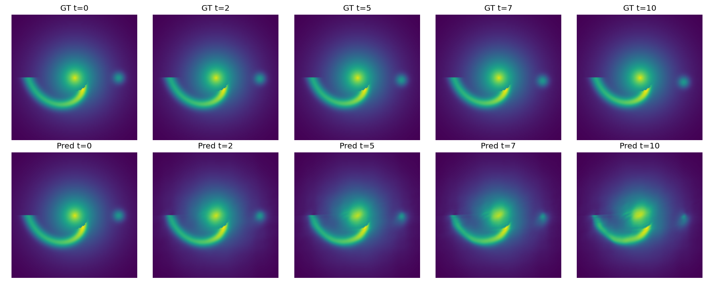
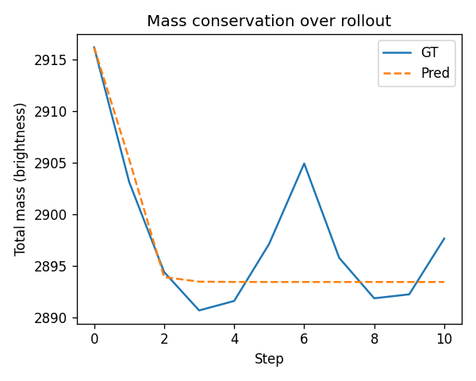
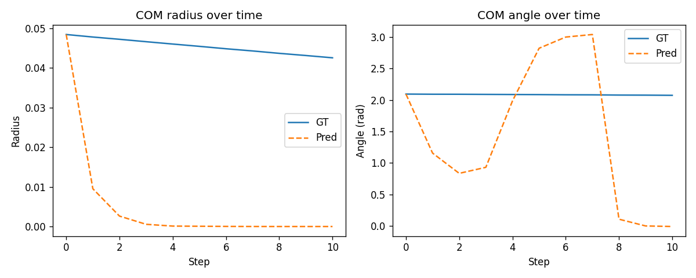

# Event Horizon AI 🌌

**Event Horizon AI** is a physics-aware neural surrogate for black hole accretion flows.  
Instead of running expensive GRMHD (General Relativistic MagnetoHydroDynamics) simulations on a supercomputer, this project trains a neural operator that learns to evolve an accretion disk forward in time from data.

> **Phase 1 status:** ✅ Completed  
> Learned surrogate on synthetic GRMHD-like data + basic physics evaluation.

---

## 🌠 What does Phase 1 do?

Phase 1 focuses on a simplified setting:

- A synthetic 2D accretion disk around a black hole  
- Bright ring + orbiting hotspot  
- Time sequences stored in a local `synth_grmhd.h5` file (not committed to Git)

We train a **Fourier Neural Operator (FNO)** to do:

**Given the current disk frame and physical parameters → predict the next frame.**

The model is **physics-regularized** with simple priors:

- approximate **mass conservation** (total brightness stays similar)  
- stable **radial profile** of the disk  
- smooth **center-of-brightness (COM)** motion  

## 🖼 Phase 1 visual results
**Accretion Disk Evolution: Ground Truth vs Predicted Frames (C1):**



**Mass conservation over rollout (C1 model):**



**Center-of-mass radius and angle over time:**



The result is a **fast, differentiable surrogate** that can roll out the disk evolution for multiple time steps.

---

## 📁 Repository structure (Phase 1)

```text
event-horizon-ai/
├─ README.md
├─ .gitignore
├─ src/
│  ├─ fno2d.py               # Fourier Neural Operator model
│  └─ physics_losses.py      # mass & COM physics priors
├─ scripts/
│  ├─ train_synth_physics.py # Phase 1 training (C1 model)
│  └─ eval_physics_metrics.py# mass + COM evaluation
├─ results/
│  ├─ mass_rollout.png    # mass vs time (GT vs prediction)
│  ├─ com_rollout.png     # COM radius & angle vs time
│  └─ rollout_toy.png # sample rollout visualization
|  └─ rollout_error_toy.png 
├─ data/                     # local data (ignored in git)
├─ checkpoints/              # trained weights (ignored)
└─ logs/                     # training logs, raw plots (ignored)
